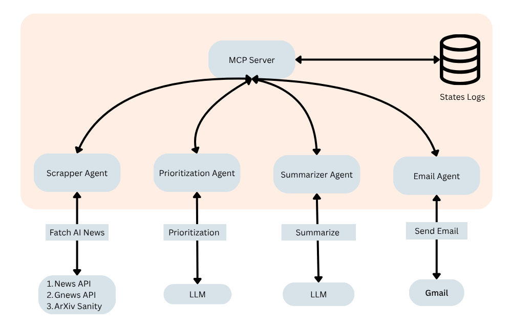

# 📰 Agentic AI Newsletter System

An automated pipeline that scrapes the latest news and research on agentic AI, prioritizes and summarizes the most relevant content, and sends it to subscribers via email. This system uses multiple agents working together to automate the process of creating an AI-focused newsletter.

---

## 🚀 Features

- 🔎 Scrapes content from:
  - News API
  - GNews API
  - arXiv (Agentic AI research)
- 🧠 Uses LLMs for:
  - Prioritizing relevant content
  - Summarizing key insights
- 📧 Sends AI-curated newsletter to email subscribers via Gmail
- 🖥️ FastAPI backend for running the pipeline via `/scrape` endpoint

---

## 🧱 System Architecture



---

## 🧠 Agents Overview

| Agent                 | Role                                                        |
| --------------------- | ----------------------------------------------------------- |
| `ScraperAgent`        | Fetches recent news/research about agentic AI               |
| `PrioritizationAgent` | Ranks articles using LLMs based on relevance                |
| `SummarizationAgent`  | Summarizes top-ranked articles using LLM                    |
| `EmailAgent`          | Sends the newsletter to subscribers via Gmail               |
| `MCP Server`          | Orchestrates agent communication and logs state transitions |

---

## 🛠️ Installation

```bash
cd Newsletter
pip install .
```
